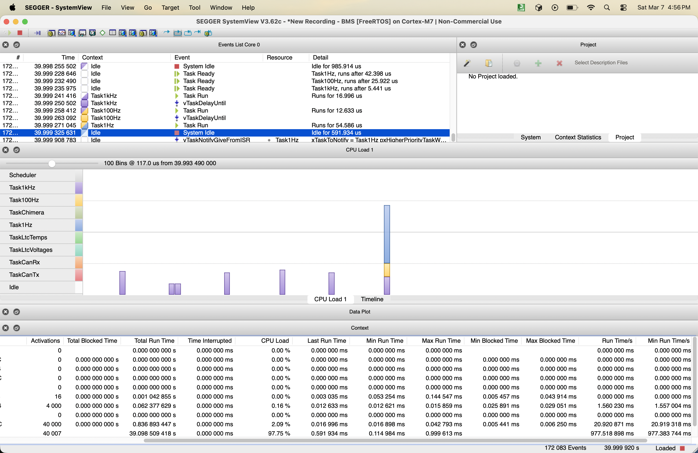
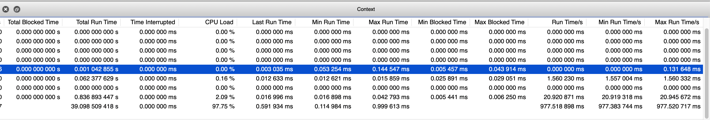
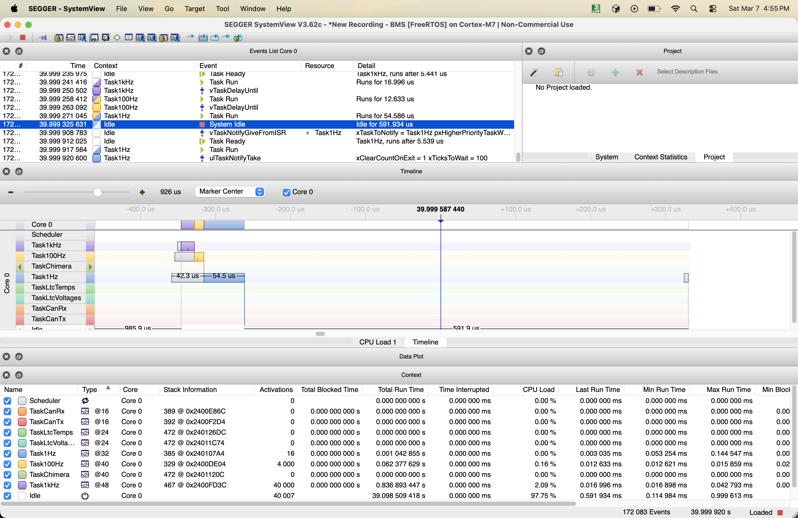
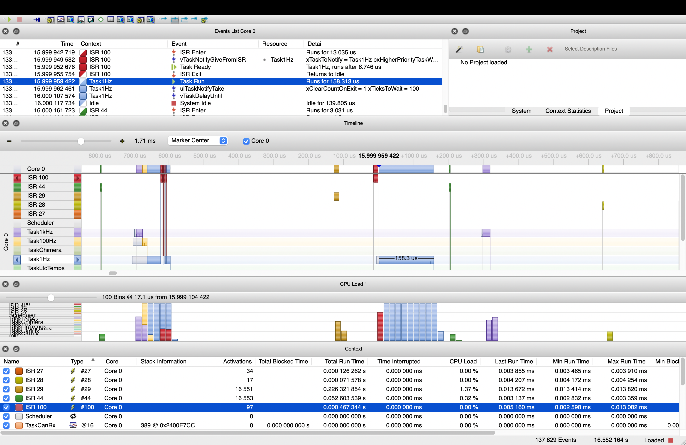
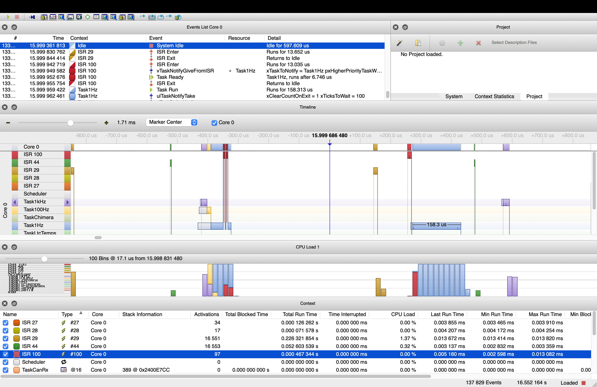
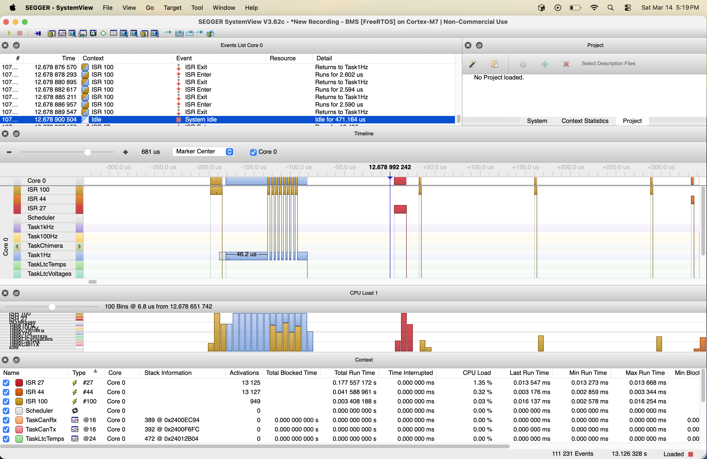
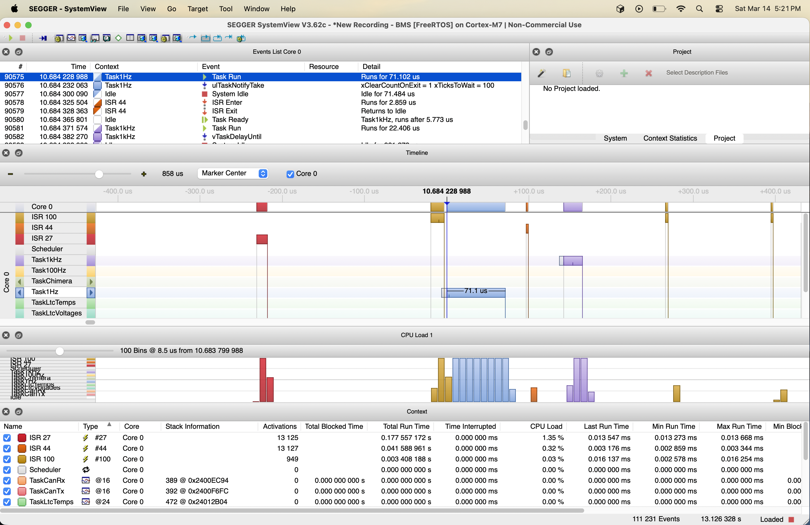
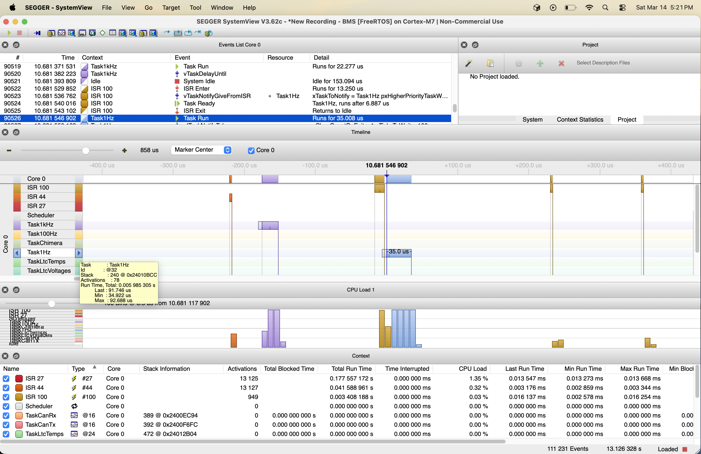
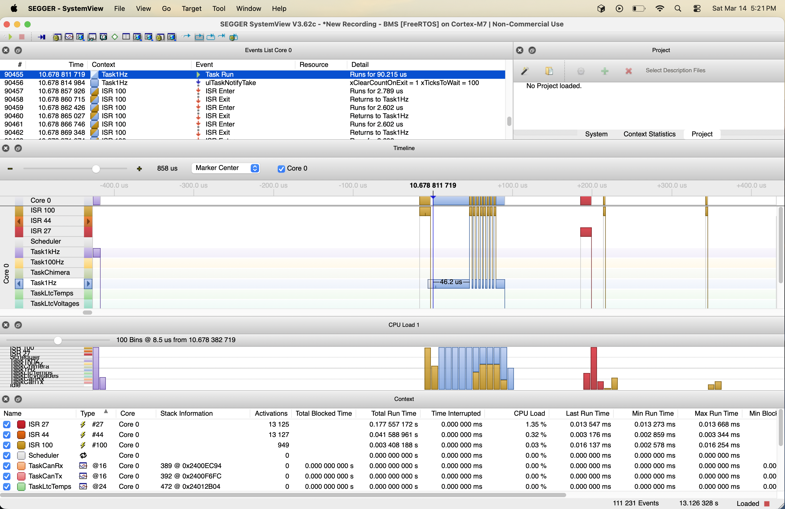

# The DMA Rewrite That Made Nothing Faster

*Notes from the UBC Formula Electric battery management system, spring 2026.*

Every so often you do a piece of work that comes out clean, gets merged, and teaches you something completely different from what you set out to learn. This is one of those. I spent a few weeks moving our battery monitor off interrupt-driven SPI and onto DMA, fought a protocol bug that had nothing to do with DMA, built the thing properly, instrumented it, measured it, and found no improvement at all.

The measurement is the interesting part, so I want to walk through it honestly rather than quietly deleting the traces and writing a post about my nice state machine.

## What the BMS is actually doing

Our accumulator is monitored by a chain of ADBMS6830B cell monitors talking to an STM32H7 over isoSPI. The highest-frequency job in the whole system is reading cell voltages, and it is not a single transfer. It is a sequence:

```
CLRCELL  ->  ADCV  ->  PLCADC  ->  RDCVA .. RDCVE
 clear      start      poll        read 5 register groups
```

Every command carries a 15-bit PEC on the command word, and every register group that comes back has its own PEC to validate. So a "read the cell voltages" operation is really eight separate SPI transactions with error checking sprinkled through it.

In the original implementation each of those eight was an interrupt-driven transfer. The acquisition task fired a transfer, blocked, woke on the completion interrupt, did a little bookkeeping, fired the next one, blocked again. Eight round trips through the scheduler for one logical operation. That felt wasteful, and DMA is the obvious answer: let the peripheral move the bytes, chain the whole sequence inside the ISR, and let the task block exactly once at the start and wake exactly once at the end.

That was the plan. The plan was fine. Getting there was not.

## A week lost to the wrong three theories

The first DMA build produced garbage. I would write the configuration registers, read them back, and get values that had nothing to do with what I had just written.

I burned real time on three explanations, in this order:

**Cache coherency.** This is the classic DMA bug on an H7. DMA writes straight to SRAM, the CPU reads a stale cache line, and you get exactly this symptom. I added cache maintenance and the behaviour changed, which felt like confirmation. It was not. Our project configuration is supposed to have the D-Cache disabled entirely, so "clearing the cache fixed it" should have read as an alarm rather than a diagnosis. If the cache is off, clearing it cannot be what helped. I noticed that at the time, wrote it in my notes as a question, and then kept going anyway, which is its own lesson.

**Buffer alignment.** I aligned the DMA buffers to 32 bytes as a precaution. This changed nothing. It was never going to change anything. I did it because it was easy and I wanted to feel like I was making progress.

**Random DMA corruption.** Not a theory. Just the thing you start to believe around 2am when the first two have not worked.

The real answer was in the datasheet, in the section on command framing, which I had read and not absorbed. To reduce transfer count I had batched `WRCFGA` and `WRCFGB` into one continuous SPI transaction. The ADBMS does not allow that.

I did not have a logic analyzer on the bus, so the diagnosis came from the datasheet plus register readback over the debugger, not from a captured waveform. The traces below are SystemView task timelines from the same debugging sessions. They show what the CPU was doing while I chased this, not the SPI line itself, so treat them as debugging context rather than proof of the framing bug.

<p align="center">
  
  <br><em>Task-level SystemView trace from the session where the batched-command bug was still present. Exception tracking wasn't enabled yet, so individual ISRs don't show up here, only their effect on task timing.</em>
</p>

<p align="center">
  
  <br><em>A closer look at the per-task run-time statistics from that same capture.</em>
</p>

<p align="center">
  
  <br><em>The full timeline and task list from the same session.</em>
</p>

Every ADBMS command needs its own CS frame. CS goes high at the end of a command, stays high for at least 2 microseconds, then goes low again for the next one. Chip select on this part is not just bus arbitration. It is part of the command protocol, and the gap is how the device knows one command ended and another began.

Splitting each command into its own CS-framed DMA transfer fixed it completely and permanently, confirmed by clean register readback afterward.

<p align="center">
  
  <br><em>Same tracing setup after the fix. ISRs (100, 44, 29, 28, 27) now show up individually since exception tracking was on for this run.</em>
</p>

<p align="center">
  
  <br><em>Another snapshot from the same corrected run.</em>
</p>

The generalizable lesson, and the reason I am writing this section at all: when a peripheral works under polled or interrupt-driven access and breaks under DMA, the DMA engine is usually innocent. The slower path was accidentally providing timing that the protocol required, and DMA took that timing away. Look for what the slow path was giving you for free before you start suspecting the hardware.

## Building it properly

Once the framing was right, the actual rewrite came together quickly. The core is a phase-based state machine that advances entirely from the SPI transfer complete ISR:

```
CLEARING -> STARTING -> POLLING -> READING -> IDLE
```

I parameterised the pipeline rather than hardcoding the voltage sequence, because the same shape applies to temperature and status readback. An `AdcDmaJob` holds the clear, start, poll, and read commands plus a destination buffer, and `AdcGroupResult` holds the raw bytes and PEC validity for one register group. Adding temperature acquisition later means defining a job with `CLRAUX / ADAX_BASE / PLAUX / RDAUXA..D` and calling the same entry point. No state machine changes.

The transfer itself builds a full-duplex packet, which is the part that always looks strange the first time you see it: a command word, its PEC15, and then a run of `0xFF` dummy bytes whose only job is to clock the response out of the device.

One subtlety worth recording. The shared SPI layer originally fired a single unconditional pair of completion and error callbacks. With two state machines now sharing the bus, configuration writes and ADC reads, that meant the configuration busy flag was being set spuriously during ADC transfers. The fix was a dispatch layer that routes completion and error to whichever state machine currently owns the bus, with weak stubs in the shared HAL that the BMS overrides at link time, so boards without an ADBMS still compile.

Net effect on the calling task: five register group reads chain back to back through the ISR, `vTaskNotifyGiveFromISR` releases the task once at the end, and between those two points the task consumes zero CPU.

## Measuring it

This is where it gets uncomfortable.

I instrumented both implementations with Segger SystemView, enabled Cortex-M exception tracking so ISR entry and exit show up on the timeline instead of being invisible, and captured identical command sequences on both branches.

<p align="center">
  
  <br><em>The interrupt-driven path with ISR logging enabled.</em>
</p>

<p align="center">
  
  <br><em>Another snapshot from the same run.</em>
</p>

<p align="center">
  
  <br><em>Per-phase breakdown across the command sequence.</em>
</p>

<p align="center">
  
  <br><em>Context switching between the acquisition task and the SPI ISR.</em>
</p>

The DMA path did not measurably reduce CPU time. The two timelines look basically the same.

## Why nothing happened

I sat with the traces for a while, and there are two explanations that both fit.

**There was nothing else for the CPU to do.** DMA does not make a transfer finish sooner. It frees the CPU while the transfer is in flight. If no other task is ready to run in that window, those freed cycles go straight to the idle task and the wall-clock timeline is identical. The benefit is real, it is just invisible in a trace of a system that has nothing better to do. It should appear the moment there is competing work at the same priority band, which on a real car there absolutely is.

**The test commands were too short to expose the overhead I was trying to remove.** The SPI peripheral does not necessarily interrupt once per byte. With a FIFO it interrupts on half-full or full thresholds. A short configuration command may fit entirely inside the FIFO, in which case the interrupt-driven path takes roughly the same number of ISR entries as the DMA path and the two traces converge by construction. I was not measuring the difference. I was measuring a case where there is no difference to measure.

The second one is a benchmark design failure and it is entirely mine. A configuration read and write is the easiest thing to instrument, so that is what I instrumented, and it happens to be the workload where the optimisation cannot show up. A full voltage acquisition across five register groups moves enough bytes to cross those FIFO thresholds repeatedly. That is the test I should have run first.

So the honest summary is: the code is better, the architecture is more extensible, the CS framing bug is genuinely fixed, and I have no data yet showing the performance benefit I set out to demonstrate. Those are four separate claims and only one of them is a disappointment.

## What is next

- Re-run the comparison against a full voltage acquisition instead of a configuration cycle
- Re-run under scheduler load, with competing tasks, so the freed CPU time has somewhere to go
- Work out whether `CLRCELL` is still necessary. It zeroes the voltage registers so that reading an unfinished conversion returns zeros instead of stale data, but the DMA polling phase already establishes that the conversion completed, which may make the clear redundant
- Extend the job abstraction to temperature acquisition
- Reconcile the DMA tick with the reworked job scheduler so the voltage task actually runs the DMA path

And one thing still genuinely unresolved: why cache maintenance changed behaviour at all, when the D-Cache is supposed to be disabled in our configuration. Either it is not disabled where I think it is, or the effect I attributed to cache clearing was a timing side effect of the extra instructions, which would fit the CS framing root cause a little too neatly to ignore.
